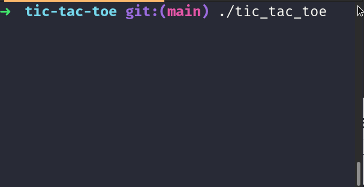

# Tic Tac Toe C++

This is a simple tic tac toe app written in some basic C++.

## Installation


```bash
git clone git@github.com:daniel-schroeder-dev/tic-tac-toe-cpp.git
cd tic-tac-toe-cpp
```

## Usage

If you're running Linux, you may be able to just run the executable that's included:

```bash
./tic_tac_toe
```

Otherwise, you can compile the `.cpp` file and run that using whatever compiler you have on your machine! Here's how I do it with `g++`:

```bash
g++ tic_tac_toe.cpp -o tic_tac_toe && ./tic_tac_toe
```



## Contributing
Pull requests are welcome. For major changes, please open an issue first to discuss what you would like to change.

Please make sure to update tests as appropriate.

## License
[MIT](https://choosealicense.com/licenses/mit/)
